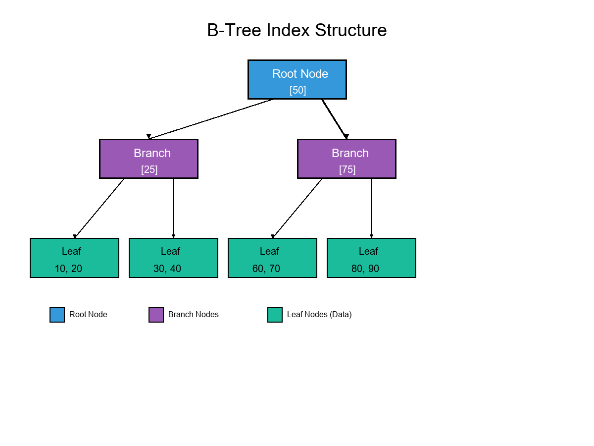

## Q7. Transactions, Isolation & Integrity

### 1. ACID Properties and Data Reliability

To ensure database reliability during concurrent operations, every transaction must adhere to the ACID model, which is critical for preventing data loss during system failures:

- **Atomicity:** The "all-or-nothing" rule. If a student's grade update involves multiple table changes, either all changes succeed or none are applied.
- **Consistency:** Every transaction moves the database from one valid state to another, ensuring all constraints (such as Foreign Keys) are satisfied.
- **Isolation:** Ensures that transactions running at the same time do not interfere with each other. Intermediate states of a transaction are hidden from others.
- **Durability:** Once a transaction is committed, the changes are permanent and will survive even a system crash or power loss.

### 2. Isolation Levels and Anomalies

Database systems allow us to choose isolation levels to balance performance and accuracy. Higher isolation prevents more anomalies but may reduce concurrency.

| Isolation Level     | Dirty Read | Non-Repeatable Read | Phantom Read |
|--------------------|:----------:|:-------------------:|:------------:|
| Read Uncommitted   |   Allowed  |       Allowed       |   Allowed    |
| Read Committed     | Prevented  |       Allowed       |   Allowed    |
| Repeatable Read    | Prevented  |      Prevented      |   Allowed    |
| Serializable       | Prevented  |      Prevented      |  Prevented   |

**Anomalies:**
- **Dirty Read:** Reading data that hasn't been committed yet.
- **Non-Repeatable Read:** Reading the same row twice and getting different results.
- **Phantom Read:** A range of rows changes because another user inserted new data.

### 3. How Constraints and Transactions Protect Integrity

Integrity is protected by two layers:
- **Constraints** (e.g., NOT NULL, UNIQUE) define the rules of the data.
- **Transactions** ensure the steps to save that data are completed safely.

#### Transaction and Constraint Flow

**References:**
- PostgreSQL Global Development Group (2026). Documentation.
- Silberschatz, A., Korth, H. F., & Sudarshan, S. (2019). Database System Concepts.

---

## Q8. Indexing for Query Performance

### 1. B-Tree Indexes

The B-Tree (Balanced Tree) is the primary indexing method used in relational databases. It allows the database to find records efficiently without scanning every row.

- **Predicates:** Speeds up queries like `WHERE student_id = 10`.
- **Joins:** Facilitates rapid matching of primary and foreign keys.
- **Ordering:** B-Trees are naturally sorted, making `ORDER BY` operations faster.

#### B-Tree Visualization

### 2. Hash and Bitmap Indexes

- **Hash Indexes:** Used for exact equality lookups (e.g., `WHERE id = 5`). Faster than B-Trees for equality, but cannot do range searches.
- **Bitmap Indexes:** Ideal for columns with low cardinality (e.g., "Active/Inactive" status).

### 3. Risks and Overhead

Every index comes with a cost:
- **Write Overhead:** Every INSERT or UPDATE must also update the index, which can slow down data entry.
- **Storage:** Indexes occupy disk space.
- **Selectivity:** An index on a column with many duplicate values (e.g., "Country") is often ignored by the database because it isn't selective enough to be helpful.

**References:**
- PostgreSQL Global Development Group (2026). Documentation.
- Silberschatz, A., Korth, H. F., & Sudarshan, S. (2019). Database System Concepts.
